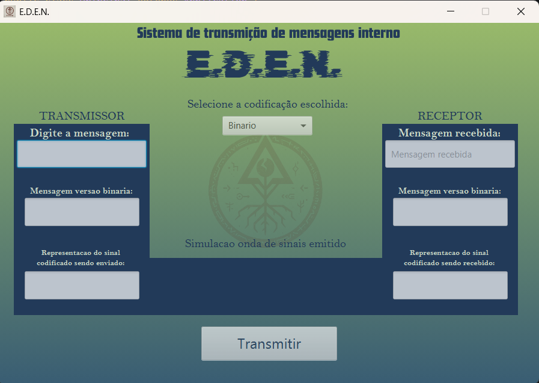

# E.D.E.N. - Simulador de Transmissão da Camada Física
 

Simulador didático desenvolvido em Java com JavaFX para a disciplina de Redes de Computadores. O projeto **E.D.E.N. (Estudo Didático de Envio em Rede)** demonstra visualmente o processo de transmissão de uma mensagem de texto, desde a sua conversão em bits até a codificação do sinal na Camada Física do modelo OSI.

<br>



## 📜 Sobre o Projeto

Este simulador foi criado para ilustrar de forma prática os conceitos abstratos da Camada Física em redes de computadores. O usuário pode inserir uma mensagem de texto, escolher um dos três métodos de codificação de sinal e visualizar todo o processo passo a passo, incluindo a representação binária da mensagem, o sinal codificado e uma animação da transmissão em forma de onda quadrada.

O projeto simula o fluxo de dados através das seguintes camadas:
* **Aplicação do Transmissor:** Captura a mensagem de texto.
* **Camada de Aplicação do Transmissor:** Converte a mensagem em um fluxo de bits.
* **Camada Física do Transmissor:** Codifica o fluxo de bits em um sinal elétrico simulado.
* **Meio de Comunicação:** "Transporta" o sinal do transmissor para o receptor.
* **Camada Física do Receptor:** Decodifica o sinal de volta para um fluxo de bits.
* **Camada de Aplicação do Receptor:** Converte os bits de volta para a mensagem de texto original.
* **Aplicação do Receptor:** Exibe a mensagem decodificada.

## ✨ Funcionalidades

* **Interface Gráfica Intuitiva:** Desenvolvida com JavaFX, permitindo uma interação clara e objetiva.
* **Múltiplos Esquemas de Codificação:** Permite ao usuário escolher entre três tipos de codificação de sinal:
    1.  **Binária (NRZ - Non-Return to Zero):** Representação direta dos bits 0 e 1 em níveis de tensão.
    2.  **Manchester:** Cada bit é representado por uma transição de tensão no meio do intervalo do bit. `0` é codificado como uma transição de `baixo` para `alto` (`01`). `1` é codificado como uma transição de `alto` para `baixo` (`10`).
    3.  **Manchester Diferencial:** A transição no início de um bit denota '0', enquanto a ausência de transição denota '1'.
* **Visualização Detalhada:** Exibe a mensagem original, sua representação binária e a forma binária do sinal codificado, tanto no transmissor quanto no receptor.
* **Animação da Transmissão:** Uma animação em `Canvas` exibe a onda quadrada do sinal sendo transmitido, ajudando a visualizar a diferença entre os níveis de tensão.

## 🛠️ Tecnologias Utilizadas

* **Java:** Linguagem de programação principal utilizada para toda a lógica do simulador.
* **JavaFX:** Framework utilizado para a construção da interface gráfica do usuário (GUI).
* **FXML:** Linguagem de marcação baseada em XML usada para definir a estrutura da interface do usuário.

## ⚙️ Como Funciona a Lógica

O fluxo de simulação é iniciado na classe `AplicacaoTransmissora` e segue uma arquitetura em camadas:

1.  **Conversão para Bits:** A mensagem em `String` é convertida para um array de inteiros (`int[]`), onde cada inteiro agrupa 32 bits da mensagem. Isso é feito pela classe `ManipulacaoBits` para otimizar a manipulação.

2.  **Codificação do Sinal:** Na `CamadaFisicaTransmissora`, o array de bits é processado de acordo com o método de codificação selecionado pelo usuário.
    * **Binário:** O fluxo de bits é mantido como está.
    * **Manchester:** Cada bit `1` é transformado em `10` e cada bit `0` em `01`.
    * **Manchester Diferencial:** Um bit `0` causa uma transição de nível no início do sinal, enquanto um bit `1` mantém o nível.
   

3.  **Transmissão e Animação:** A classe `MeioDeComunicacao` simula a transferência do sinal codificado para o receptor. O `ControlerTelaPrincipal` utiliza um `AnimationTimer` para desenhar a onda quadrada correspondente ao sinal em um `Canvas`.

4.  **Decodificação e Exibição:** O processo é revertido na `CamadaFisicaReceptora` e `CamadaAplicacaoReceptora`, onde o sinal é decodificado para bits e, em seguida, para texto, que é finalmente exibido na tela.

## 🚀 Como Executar o Projeto

Para executar este projeto, você precisará ter o **JDK (Java Development Kit)** e o **JavaFX SDK** instalados e configurados no seu ambiente.

1.  **Clone o repositório:**
    ```bash
    git clone [https://github.com/iram0ss/trabalho01-redes1-camadafisica.git](https://github.com/iram0ss/trabalho01-redes1-camadafisica.git)
    cd trabalho01-redes1-camadafisica
    ```

2.  **Compile o projeto:**
    * Navegue até o diretório que contém os arquivos `.java`.
    * Execute o comando de compilação, certificando-se de incluir o caminho para as bibliotecas do JavaFX.
    ```bash
    javac --module-path /caminho/para/seu/javafx-sdk/lib --add-modules javafx.controls,javafx.fxml *.java
    ```

3.  **Execute o projeto:**
    * Após a compilação, execute a classe principal.
    ```bash
    java --module-path /caminho/para/seu/javafx-sdk/lib --add-modules javafx.controls,javafx.fxml Principal
    ```
    *Obs: Substitua `/caminho/para/seu/javafx-sdk/lib` pelo caminho real onde você descompactou o JavaFX SDK.*

## Vídeo Demonstrativo


## 👤 Autor

* **Iury Ramos Sodré**
* **Matrícula:** 202310440
* **Início:** 19/08/2025
* **Última alteração:** 26/08/2025
